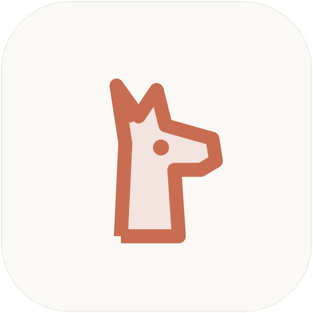
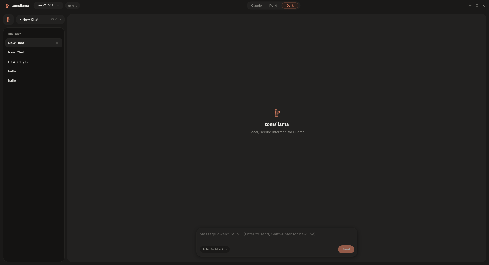
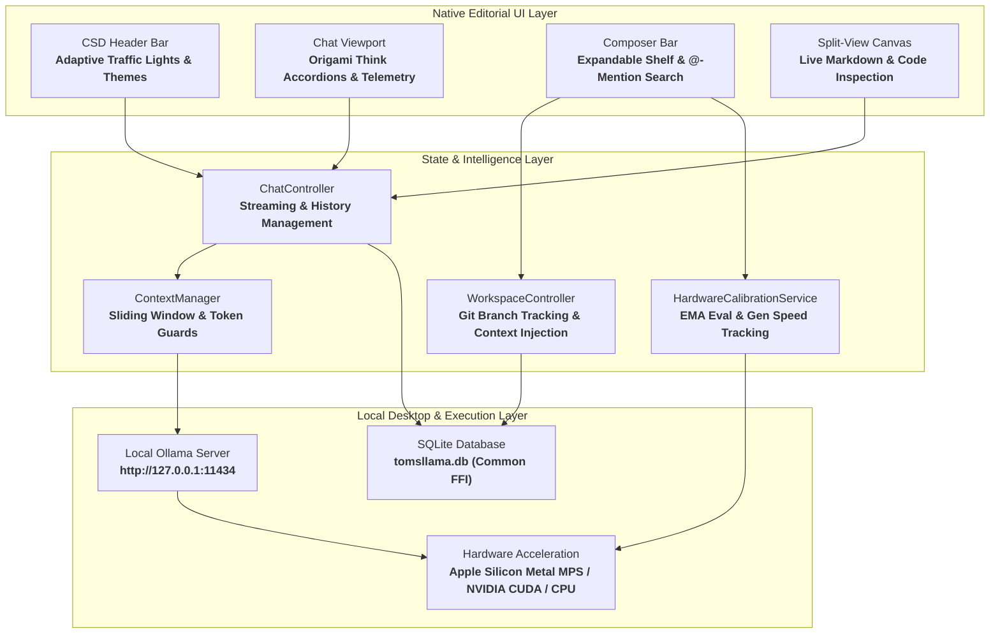

<div align="center">
  
  <h1>tomsllama</h1>
  <p><strong>A private, distraction-free native desktop client for local Ollama models with project workspaces, dynamic hardware calibration, and zero cloud telemetry.</strong></p>

  <p>
    
    
    
    
    
    
  </p>
</div>

---



---

## Architecture Overview

**tomsllama** is engineered from the ground up as a native desktop client with complete offline isolation. It connects directly to your local Ollama daemon without external proxies, analytics, or third-party servers.



---

## Core Capabilities

- **Local Token Streaming:** Streams responses directly from your local **Ollama** daemon token-by-token over cleartext loopback sockets with sub-millisecond response latency.
- **Claude-Style Workspaces:** Group chats inside dedicated project workspaces with custom **System Prompts**, automated **Git** repository detection, active **Branch Tracking**, and isolated context file sets.
- **Multi-File & Directory Ingestion:** Attach individual files or full directory trees to the composer. Code files and documents are parsed, token-counted, and formatted into clean context blocks.
- **Native PDF Text Extraction:** Parses PDF documentation directly on your workstation via **Syncfusion PDF** without headless browsers or external OCR dependencies.
- **Keyboard Fuzzy `@`-Mentions:** Type **`@`** inside the composer text field to summon an instant fuzzy-filtered search popup to attach workspace files directly from the keyboard.
- **Per-Model Hardware Calibration:** Continuously benchmarks your system's prompt evaluation speed (**eval tok/s**) and token generation rate (**gen tok/s**). Accurately forecasts expected response duration before dispatching queries.
- **Expandable Telemetry Shelf:** Collapsible HUD mounted directly to the composer header displaying active **Git branch**, file token footprints, predicted CPU/GPU duration, and session metrics.
- **Execution Mode Presets:** Three discrete inference profiles replacing clumsy temperature sliders:
  - **Schnell (0.3):** Low temperature, tight context window, optimized for fast factual queries and deterministic code edits.
  - **Optimal (0.7):** Balanced sampling parameters for everyday problem solving and natural dialogue.
  - **Denken (0.6):** Extended thinking budget and reasoning headroom for deep reasoning models like **DeepSeek-R1** and **Qwen2.5-Coder**.
- **Reasoning Blocks:** Collapsible **`<think>`** accordions displaying live evaluation countdowns, calculation times, and token counts.
- **Split-View Canvas:** Side-by-side artifact canvas to inspect, review, and copy generated code, markdown documents, or math formulations without losing conversational context.
- **Prompt History Recall:** Use **`Arrow Up`** and **`Arrow Down`** in the composer to navigate through prompt history while preserving unfinished drafts.
- **Local Persistence:** Robust persistence for conversations, messages, personas, and workspaces stored in **SQLite** via **`sqflite_common_ffi`**.
- **Editorial Typography & Themes:** Anti-AI-slop interface with 1px hairlines, floating pills, and typography (**Newsreader**, **Inter**, **Geist Mono**):
  - **Claude:** Warm ivory paper canvas with terracotta accents.
  - **Pond:** Clean mineral background with slate teal highlights.
  - **Dark:** Low-contrast charcoal background with warm highlights.
  - **Pond Dark:** Deep mineral slate background with luminous teal accents.

---

## Platform Support Matrix

| Platform | Native Runner | Hardware Acceleration | Window & System Integration | Status |
| :--- | :--- | :--- | :--- | :--- |
| **macOS** | **Cocoa / AppKit** (`macos/`) | **Apple Silicon Metal (MPS)** (~160+ tok/s eval) | Native Traffic Lights (78px inset), App Sandbox, Menu Bar Tray, Dock Reopen | **Fully Supported** |
| **Linux** | **GTK3** (`linux/`) | **NVIDIA CUDA / CPU AVX2** | CSD Header Bar, Wayland / X11, GNOME Shell Dock matching, Ayatana Tray | **Fully Supported** |
| **Windows** | **C++ Win32** (`windows/`) | **DirectML / NVIDIA CUDA / CPU** | Frameless Win32 Window, Native Titlebar Snapping, Taskbar Tray | **Fully Supported** |

---

## Execution Profiles

| Mode | Temperature | Top-P | Ideal Use Cases | Context Scaling |
| :--- | :--- | :--- | :--- | :--- |
| **Schnell** | **0.30** | **0.85** | Quick syntax lookups, JSON formatting, unit tests, fast summaries | Strict 2k-4k limit for minimal CPU prompt eval latency |
| **Optimal** | **0.70** | **0.90** | Architectural discussions, feature drafting, general paired programming | Balanced 8k window with dynamic safety headroom |
| **Denken** | **0.60** | **0.95** | Multi-file reasoning, algorithm verification, DeepSeek-R1 reflection | Deep context window with dedicated `<think>` parser |

---

## Keyboard Shortcuts

| Linux / Windows | macOS | Action | Scope |
| :--- | :--- | :--- | :--- |
| **`Ctrl + N`** | **`Cmd + N`** | **New Conversation** | Global Window |
| **`Ctrl + B`** | **`Cmd + B`** | **Toggle Sidebar** | Global Window |
| **`Ctrl + K`** | **`Cmd + K`** | **Quick Switcher / Search** | Global Window |
| **`Ctrl + ,`** | **`Cmd + ,`** | **Open Application Settings** | Global Window |
| **`F11`** | **`Cmd + Ctrl + F`** | **Toggle Zen / Fullscreen** | Global Window |
| **`Esc`** | **`Esc`** | **Stop Generation / Close Modal** | Active Viewport |
| **`Enter`** | **`Enter`** / **`Cmd + Enter`** | **Send Message** | Composer Input |
| **`Shift + Enter`** | **`Shift + Enter`** | **Insert Newline** | Composer Input |
| **`Arrow Up`** | **`Arrow Up`** | **Previous Prompt in History** | Composer (First Line) |
| **`Arrow Down`** | **`Arrow Down`** | **Newer Prompt / Restore Draft** | Composer (Last Line) |
| **`@`** | **`@`** | **Trigger File Autocompletion** | Composer Input |

---

## Prerequisites & Installation

### 1. Install & Launch Ollama

Install **Ollama** from [ollama.com](https://ollama.com) and start the local daemon:

```bash
ollama serve
```

Pull your preferred local models:

```bash
ollama pull qwen2.5-coder:7b
ollama pull deepseek-r1:14b
ollama pull qwen2.5:3b
```

### 2. Development Toolchain

Ensure **Flutter SDK (>= 3.19.0)** is installed:

- **Linux (Fedora):**
  ```bash
  sudo dnf install clang cmake ninja-build gtk3-devel libayatana-appindicator-gtk3-devel
  ```
- **Linux (Ubuntu / Debian):**
  ```bash
  sudo apt install clang cmake ninja-build pkg-config libgtk-3-dev libayatana-appindicator3-dev
  ```
- **macOS:**
  ```bash
  xcode-select --install
  ```

---

## Building and Running

**1. Clone the repository:**
```bash
git clone https://github.com/tomsliikee/tomsllama.git
cd tomsllama
```

**2. Fetch dependencies:**
```bash
flutter pub get
```

**3. Run in Development Mode:**
- On **Linux**:
  ```bash
  flutter run -d linux
  ```
- On **macOS**:
  ```bash
  flutter run -d macos
  ```
- On **Windows**:
  ```bash
  flutter run -d windows
  ```

**4. Compile Standalone Release Bundles:**
- **Linux Release:**
  ```bash
  flutter build linux --release
  ```
  *Binary Location:* `build/linux/x64/release/bundle/tomsllama`

- **macOS Release:**
  ```bash
  flutter build macos --release
  ```
  *Bundle Location:* `build/macos/Build/Products/Release/tomsllama.app`

- **Windows Release:**
  ```bash
  flutter build windows --release
  ```
  *Binary Location:* `build/windows/x64/runner/Release/tomsllama.exe`

---

## Data Storage & Disk Paths

**tomsllama** stores all application state in transparent, user-accessible locations without hidden registry entries:

| File / Directory | Platform | Description |
| :--- | :--- | :--- |
| **`~/Documents/tomsllama/tomsllama.db`** | **Linux / Windows / macOS** | Primary **SQLite Database** storing conversations, messages, workspaces, and personas |
| **`~/Documents/tomsllama/settings.json`** | **Linux / Windows / macOS** | Hardware benchmark statistics, custom speed profiles, and active UI preferences |
| **`~/.local/share/applications/tomsllama.desktop`** | **Linux** | XDG Desktop Entry with `StartupWMClass` matching for GNOME Shell and Wayland docks |
| **`~/.local/share/icons/hicolor/`** | **Linux** | Scalable application icon assets (16px to 512px) |
| **`~/Library/Containers/com.haiden.tomsllama/`** | **macOS** | Sandboxed container root when distributed with App Sandbox enabled |

---

## License

Distributed under the **MIT License**. See [`LICENSE`](LICENSE) for complete terms.
