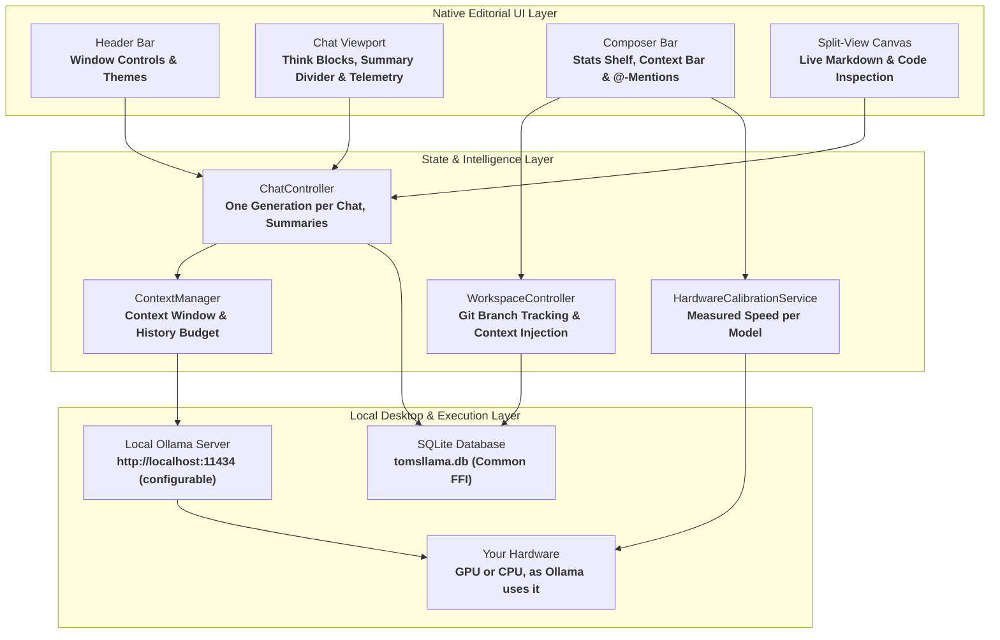

<div align="center">
  
  <h1>tomsllama</h1>
  <p><strong>A calm desktop client for local Ollama models, with project workspaces, measured time estimates, and nothing sent to the cloud.</strong></p>

  <p>
    
    
    
    
    
    
  </p>
</div>

---


---

## Architecture Overview

**tomsllama** is a **Flutter** desktop application that talks directly to the **Ollama** daemon on your machine. There is no proxy, no analytics and no account. Conversations live in a local **SQLite** file.



---

## Core Capabilities

- **Local Streaming:** Answers stream token by token from your local **Ollama** daemon. The URL is configurable in the settings, so a daemon on another machine in your network works too.
- **Answers Keep Running:** Each answer belongs to its chat. Open another chat and the first one keeps generating in the background; its row in the sidebar breathes until it is done.
- **Workspaces:** Group chats in a project workspace with its own **system prompt** and **knowledge files**. An attached folder shows its **Git** branch.
- **Files & Folders:** Attach files or a whole directory by button, drag and drop, or by typing **`@`** in the composer for a fuzzy file search. **PDF** text is extracted locally via **Syncfusion PDF**.
- **Measured Time Estimates:** The app records how fast each model reads and writes on your hardware and how long it takes to load, then tells you roughly how long an answer will take before and while you wait.
- **Context Usage Bar:** The stats shelf shows how full the chat's **context window** is, using the token counts **Ollama** reports, next to the limit of the selected model. Every model's limit is read from the daemon, so nothing is fixed per model.
- **`/compact` and Automatic Summaries:** Type **`/compact`** to fold the chat so far into a summary and continue from it; text after the command says what to keep. Older turns are also summarised automatically when the window fills up. A divider in the chat marks the cut and opens to show the summary. The old messages stay readable.
- **Context Window Setting:** Run chats in an automatic small window (fast on a CPU) or pick **4k** to **32k** or the **model maximum**. The choice is always capped at what the model supports.
- **Execution Modes:** **Schnell**, **Optimal** and **Denken** set the sampling temperature and switch reasoning off, to the model's default, or on.
- **Reasoning Blocks:** Thinking output of models such as **DeepSeek-R1** is kept apart from the answer in a collapsible block with its duration and token count.
- **Split-View Canvas:** Open any code block beside the chat, with syntax highlighting, to read or copy it without losing your place.
- **Chat Management:** Search, pin and reorder chats, export a chat as **Markdown**, **JSON** or **HTML**, and recall earlier prompts with **`Arrow Up`** and **`Arrow Down`**.
- **Settings:** Ollama URL, default model, **custom instructions** added to every chat, context window, automatic summaries, and close-to-tray.
- **Local Persistence:** Conversations, messages and workspaces are stored in **SQLite** via **`sqflite_common_ffi`**.
- **Four Themes, Three Typefaces:** Hairlines, floating pills, and one job per typeface: **Newsreader** for reading, **Inter** for interface text, **Geist Mono** for labels and code. All fonts are bundled.
  - **Claude:** Warm ivory paper with terracotta accents.
  - **Pond:** Mineral white with slate teal.
  - **Dark:** Warm charcoal with copper.
  - **Pond Dark:** Deep slate with teal.

---

## Platform Support Matrix

| Platform | Runner | Window & System Integration | Status |
| :--- | :--- | :--- | :--- |
| **Linux** | **GTK3** (`linux/`) | Custom header bar, Wayland / X11, tray icon | ***Tested*:** the development platform (Fedora, GNOME, Wayland) |
| **Windows** | **Win32** (`windows/`) | Frameless window, tray icon | ***Untested.*** The runner is in the repository; no build has been verified |
| **macOS** | **Cocoa / AppKit** (`macos/`) | Native traffic lights, menu bar icon, Dock reopen | ***Not yet built successfully.*** The code is in place; a first build on a Mac failed and the fix is unconfirmed |

Speed depends on how **Ollama** runs the model on your machine (GPU or CPU), not on this app.

---

## Execution Modes

| Mode | Temperature | Reasoning (thinking models) | Suited For |
| :--- | :--- | :--- | :--- |
| **Schnell** | **0.3** | **Off** | Quick lookups, formatting, short factual answers |
| **Optimal** | **0.7** | **Model default** | Everyday questions and pair programming |
| **Denken** | **0.6** | **On** | Multi-step reasoning with models such as **DeepSeek-R1** |

---

## Keyboard Shortcuts

| Linux / Windows | macOS | Action | Scope |
| :--- | :--- | :--- | :--- |
| **`Ctrl + N`** | **`Cmd + N`** | **New Conversation** | Global Window |
| **`Ctrl + B`** | **`Cmd + B`** | **Toggle Sidebar** | Global Window |
| **`Ctrl + K`** | **`Cmd + K`** | **Quick Switcher / Search** | Global Window |
| **`Ctrl + ,`** | **`Cmd + ,`** | **Open Application Settings** | Global Window |
| **`F11`** | **`Cmd + Ctrl + F`** | **Toggle Zen / Fullscreen** | Global Window |
| **`Esc`** | **`Esc`** | **Stop Generation / Close Modal** | Active Viewport |
| **`Enter`** | **`Enter`** / **`Cmd + Enter`** | **Send Message** | Composer Input |
| **`Shift + Enter`** | **`Shift + Enter`** | **Insert Newline** | Composer Input |
| **`Arrow Up`** | **`Arrow Up`** | **Previous Prompt in History** | Composer (First Line) |
| **`Arrow Down`** | **`Arrow Down`** | **Newer Prompt / Restore Draft** | Composer (Last Line) |
| **`@`** | **`@`** | **Trigger File Autocompletion** | Composer Input |
| **`/compact`** | **`/compact`** | **Summarise the chat so far and free up context** (text after it says what to keep) | Composer Input |

---

## Prerequisites & Installation

### 1. Install & Launch Ollama

Install **Ollama** from [ollama.com](https://ollama.com) and start the local daemon:

```bash
ollama serve
```

Pull your preferred local models:

```bash
ollama pull qwen2.5-coder:7b
ollama pull deepseek-r1:14b
ollama pull qwen2.5:3b
```

### 2. Development Toolchain

Install the **Flutter SDK** (3.19 or newer), then the platform's build tools:

- **Linux (Fedora):**
  ```bash
  sudo dnf install clang cmake ninja-build gtk3-devel libayatana-appindicator-gtk3-devel
  ```
- **Linux (Ubuntu / Debian):**
  ```bash
  sudo apt install clang cmake ninja-build pkg-config libgtk-3-dev libayatana-appindicator3-dev
  ```
- **macOS:** the full Xcode app from the App Store (the command line tools alone cannot build a Flutter app), then:
  ```bash
  sudo xcodebuild -runFirstLaunch
  brew install cocoapods
  ```

---

## Building and Running

**1. Clone the repository:**
```bash
git clone https://github.com/tomsliikee/tomsllama.git
cd tomsllama
```

**2. Fetch dependencies:**
```bash
flutter pub get
```

**3. Run in Development Mode:**
- On **Linux**:
  ```bash
  flutter run -d linux
  ```
- On **macOS**:
  ```bash
  flutter run -d macos
  ```
- On **Windows**:
  ```bash
  flutter run -d windows
  ```

**4. Compile Standalone Release Bundles:**
- **Linux Release:**
  ```bash
  flutter build linux --release
  ```
  *Binary Location:* `build/linux/x64/release/bundle/tomsllama`

- **macOS Release:**
  ```bash
  flutter build macos --release
  ```
  *Bundle Location:* `build/macos/Build/Products/Release/tomsllama.app`

- **Windows Release:**
  ```bash
  flutter build windows --release
  ```
  *Binary Location:* `build/windows/x64/runner/Release/tomsllama.exe`

**5. Install to System App List & Launchpad:**

- **macOS (Applications Folder, Launchpad & Spotlight):**
  Install the compiled bundle directly into `/Applications` to automatically register **tomsllama** in the macOS **App List**, **Launchpad**, and **Spotlight (`Cmd + Space`)** with its high-resolution native icon:
  ```bash
  # Install into system Applications folder
  cp -R build/macos/Build/Products/Release/tomsllama.app /Applications/

  # Remove Gatekeeper quarantine flag for local unnotarized builds
  xattr -cr /Applications/tomsllama.app
  ```

- **Linux (Desktop Launcher & GNOME App Grid):**
  The release is a folder, not a single file: the binary needs the `lib/` and `data/` directories next to it. Copy the whole bundle and register it with the application launcher:
  ```bash
  # Copy the whole bundle and the icon
  mkdir -p ~/.local/share/tomsllama ~/.local/share/applications ~/.local/share/icons/hicolor/512x512/apps
  cp -R build/linux/x64/release/bundle/. ~/.local/share/tomsllama/
  cp assets/app_icon.png ~/.local/share/icons/hicolor/512x512/apps/tomsllama.png

  # Create the desktop entry
  cat << EOF > ~/.local/share/applications/tomsllama.desktop
  [Desktop Entry]
  Name=tomsllama
  Comment=Local AI Client for Ollama
  Exec=$HOME/.local/share/tomsllama/tomsllama
  Icon=tomsllama
  Terminal=false
  Type=Application
  Categories=Utility;Development;
  StartupWMClass=com.example.tomsllama
  EOF

  update-desktop-database ~/.local/share/applications/
  ```

---

## Data Storage & Disk Paths

**tomsllama** keeps everything in plain files you can find, back up or delete:

| File / Directory | Platform | Description |
| :--- | :--- | :--- |
| **`~/Documents/tomsllama/tomsllama.db`** | **Linux / Windows** | **SQLite database** with conversations, messages, summaries and workspaces |
| **`~/Documents/tomsllama/settings.json`** | **Linux / Windows** | Settings, the theme, and the measured speed of each model |
| **`~/.local/share/applications/tomsllama.desktop`** | **Linux** | Desktop entry, if you installed it as described above |
| **`~/Library/Application Support/com.haiden.tomsllama/`** | **macOS** | Database and settings (*planned*: see the platform table) |

---

## License

Distributed under the **MIT License**. See [`LICENSE`](LICENSE) for complete terms.
